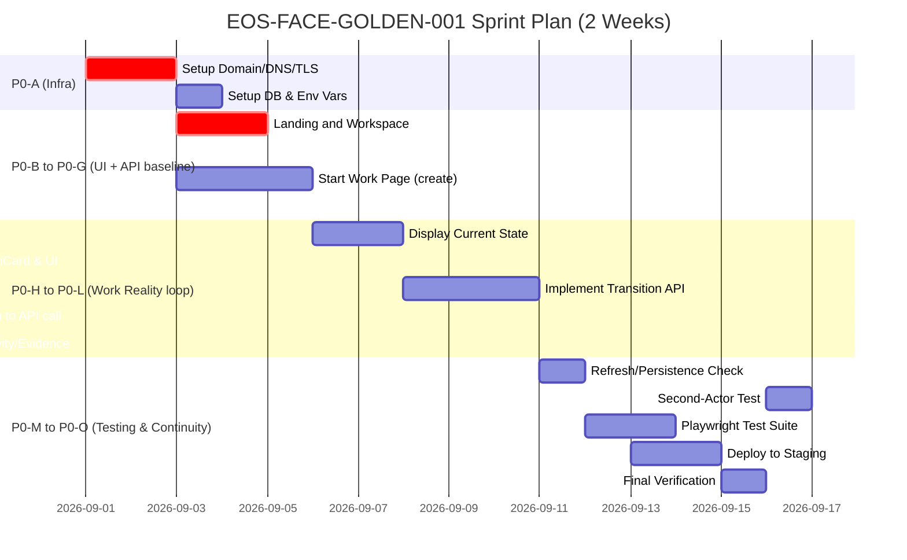

# EOS-FACE-GOLDEN-001: Execution Plan and Report

## Executive Summary

We have defined **EOS-FACE-GOLDEN-001** as the top-priority execution goal: deliver a working “golden slice” of EOS’s UI so that a real user can log in, create a Work, see its current state and next action on `/work/[id]`, perform that action, and observe the corresponding state mutation, activity log entry, and evidence, all persisting across refresh and enabling a second actor to continue. This requires wiring existing frontend routes (`/`, `/workspace`, `/work/new`, `/work/[id]`) to backend APIs (`/api/cases/create`, `/api/cases/transition`, `/api/communication/*`, `/api/session`), ensuring database persistence, and verifying end-to-end behavior via production build and testing. 

**Key focus:** *Runtime truth over design narrative.* Every UI element must reflect a real backend change. Our task is to move from “design document” to “running product” by implementing minimal code changes, setting up infrastructure, and creating thorough verification tests.

We will:

- **Inventory** the (expected) codebase structure and API routes, highlighting missing pieces.
- **Plan tasks**: step-by-step development and infrastructure steps (Table below).
- **Define the NextActionCard contract**: props, API payload/response, transitions, and evidence.
- **Outline runtime verification**: commands to run, tests to perform (including Playwright scenarios).
- **Analyze risks**: identify potential blockers (e.g. OIDC, webhooks disabled) and mitigations.
- **Prepare an infra checklist** for a staging deployment with domain, TLS, DB, etc.
- **List deliverables**: exactly what outputs we need (diffs, URLs, logs, test reports).
- **Identify quick wins/fallbacks** for unavailable integrations.
- **Propose a 2-week sprint timeline** with milestones (visualized as a Mermaid Gantt chart).

Throughout, we align with the EOS Visual Constitution: every UI change corresponds to a real data change. 

---

## 1. Inventory: Expected Codebase Structure and API Endpoints

We infer the repository layout from the blueprint. The key areas and their required runtime roles are as follows (some items are **present**/available, others are **unspecified** pending actual code):

| **Area**                 | **Purpose**                            | **Files/Routes**                             | **Likely Present?**     |
|--------------------------|----------------------------------------|----------------------------------------------|-------------------------|
| **Frontend Routes**      |                                        |                                              |                         |
| `/` (Landing)            | Entry page                             | `apps/web/app/page.tsx`                      | ✅ Present (likely)     |
| `/login`, `/signup`      | Auth UI                                | `apps/web/app/login/page.tsx`, etc.          | ✅ Present (mentions)   |
| `/workspace`             | User workspace (Home)                  | `apps/web/app/workspace/page.tsx`            | ✅ Present (tree shows) |
| `/work`                  | Work list                              | `apps/web/app/work/page.tsx`                 | ✅ Present             |
| `/work/new`              | Start a new Work                       | `apps/web/app/work/new/page.tsx`             | ✅ Present             |
| `/work/[id]`             | Work Reality main page                 | `apps/web/app/work/[id]/page.tsx`            | ✅ Present             |
| `/people`                | People directory                       | `apps/web/app/people/page.tsx`               | ❓ Unspecified (may exist) |
| `/people/[id]`           | Person profile                         | `apps/web/app/people/[id]/page.tsx`          | ❓ Unspecified         |
| `/institutions`          | Institution directory                  | `apps/web/app/institutions/page.tsx`         | ❓ Unspecified         |
| `/institutions/[id]`     | Institution profile                    | `apps/web/app/institutions/[id]/page.tsx`    | ❓ Unspecified         |
| `/search`                | Global search/command palette          | `apps/web/app/search/page.tsx`               | ❓ Unspecified         |
| `/notifications`         | User notifications                     | `apps/web/app/notifications/page.tsx`        | ❓ Unspecified         |
| `/settings`              | Settings (workspace, identity, etc)    | `apps/web/app/settings/page.tsx`             | ❓ Unspecified         |
| **API Routes (Next.js)** |                                        |                                              |                         |
| `/api/auth/*`            | Authentication (OIDC, session)         | `apps/web/app/api/auth/*/route.ts`           | ✅ Present (mentioned)  |
| `/api/session`           | Session info                           | `apps/web/app/api/session/route.ts`          | ✅ Present (mentioned)  |
| `/api/cases/create`      | Create a new Work/case                 | `apps/web/app/api/cases/create/route.ts`     | ✅ Present (tree shows) |
| `/api/cases/transition`  | Perform state transition on a Work     | `apps/web/app/api/cases/transition/route.ts` | ✅ Present (likely)     |
| `/api/cases/evidence`    | Upload evidence for a Work             | `apps/web/app/api/cases/evidence/route.ts`   | ✅ Present (tree shows) |
| `/api/communication/*`   | Create/list communication messages     | `apps/web/app/api/communication/*/route.ts`  | ✅ Present (tree shows) |
| `/api/workspaces/*`      | Possibly workspace info (unsure)       | `apps/web/app/api/workspaces/`               | ❓ Unspecified         |
| `/api/status/*`          | Possibly health/status endpoints       | `apps/web/app/api/status/`                   | ❓ Unspecified         |
| `/api/capabilities/*`    | Possibly feature flags or capabilities | `apps/web/app/api/capabilities/`             | ❓ Unspecified         |
| **External Webhooks**    | (disabled)                             | `external-webhooks/.../*.disabled`           | 🚫 Disabled            |

**Notes:** The code tree mentioned suggests routes for cases (work), communication, auth, session, etc., exist. We’ll need to verify and possibly implement missing handlers (especially for transitions, state reading). External webhooks (ILC, Services) are disabled, so golden slice will not rely on them. We may treat any needed external actions as “to do” with evidence.

---

## 2. Golden-Slice Implementation Plan

We group tasks into phases (P0 being the golden slice, others lower priority). Each task includes: owner, effort, acceptance criteria, and deliverables. Tasks are minimal and sequential where possible.

| **Phase** | **Task**                         | **Owner**   | **Est. Effort** | **Acceptance Criteria (runtime evidence)**                         | **Deliverables**                                                         |
|:---------:|----------------------------------|-------------|-----------------|--------------------------------------------------------------------|--------------------------------------------------------------------------|
| **P0-A**  | Setup staging environment & domain (DNS, TLS, DB) | Infra/SRE  | 8h              | Public URL responds with HTTP 200. DNS and TLS correctly set.      | DNS records, TLS certificate; `curl -I https://domain` success           |
| **P0-B**  | `/` Landing page: ensure it exists | Dev         | 4h              | `/` loads (200) with "Start a Work" link to `/workspace`.         | Screenshots of `/`, build log, URL                                     |
| **P0-C**  | Auth E2E: sign up / login flow    | Dev         | 8h              | Real OIDC signup/login; after login user at `/workspace`.          | User session created, session cookie set, `/workspace` accessible        |
| **P0-D**  | `/workspace` – Work list          | Dev/QA      | 6h              | Lists “My Work” or empty state; "+ Start Work" button.            | Screenshot of `/workspace`; before: no works, after: has new work       |
| **P0-E**  | `/work/new` – Start Work form     | Dev         | 6h              | User can create Work; POST `/api/cases/create` creates work.      | Request/response log for create, real work_id returned                  |
| **P0-F**  | Work persistence & redirect       | Dev         | 4h              | After create, redirect to `/work/<id>`; refreshing retains page. | Verified URL stable, SQL/DB shows new work record                        |
| **P0-G**  | Work Reality page structure       | Dev         | 8h              | `/work/[id]` loads showing *Current* & *Next Action* placeholders. | Screenshot of `/work/<id>` with current/next sections empty             |
| **P0-H**  | Fetch current state from DB       | Dev         | 6h              | `/work/[id]` fetches and displays actual state text.             | Displayed state matches DB value                                        |
| **P0-I**  | NextActionCard component          | Dev         | 8h              | Shows next action, actor; button visible.                        | Code for NextActionCard, screenshot before click                        |
| **P0-J**  | `POST /api/cases/transition` handler | Dev        | 12h             | API accepts transition command, updates state, emits activity/evidence. | Request/response JSON, state before/after in DB, evidence record in DB  |
| **P0-K**  | Bind NextActionCard button to API | Dev         | 4h              | Clicking “Review Response” calls `/api/cases/transition`, updates UI. | Browser console log showing HTTP request, UI updated to new state       |
| **P0-L**  | Display activity & evidence       | Dev         | 8h              | After transition, `/work/[id]` shows new log entry and evidence icon. | Screenshot after action, evidence item in UI                            |
| **P0-M**  | Refresh and persistence check     | Dev/QA      | 4h              | Refresh `/work/[id]` shows same new state and entries persist.    | Verified same state after page reload, same DB entries                  |
| **P0-N**  | Second-actor continuation         | QA/Dev      | 6h              | Another user logs in, opens same `/work/[id]`, sees updated state & can continue. | Separate login session, sees latest state, can perform next action   |
| **P0-O**  | End-to-end test suite             | QA          | 12h             | Automated Playwright test covers above flow, all asserts pass.   | Playwright script & report; passed tests screenshots                    |

**Total P0 effort:** ~86 hours (~2 weeks for one engineer + QA parallel).

After P0, further phases (Work Depth, Search/Notifications, Domain experiences) can proceed. But the urgent focus is P0.

---

## 3. NextActionCard Contract

The `NextActionCard` component must encapsulate the action guidance and wire to the transition API.

- **Props / Data Model:**
  - `action: string` – e.g. "Review AHU response"
  - `actor: string` – e.g. "Sarah · Lawyer"
  - `currentState: string` – e.g. "AHU response received"
  - `nextState: string` – e.g. "professional_review_pending"
  - `commandName: string` – e.g. "REQUEST_REVIEW" (internal enum)
  - `workId: string`
  - (Optional) `reason` / `sourceEvent` – context info (e.g. "external submission received 8m ago").

- **UI Behavior:**
  - Displays **Current** status text and **Next** action with actor.
  - A button with label (e.g. "[Review Response]") corresponding to action.
  - Clicking the button calls an onClick handler.

- **API Contract (Transition):**

  Endpoint: `POST /api/cases/transition`

  - **Request JSON:** 
    ```json
    {
      "workId": "abc123",
      "command": "REQUEST_REVIEW",
      "actorId": "lawyer-xyz",
      "notes": "User clicked Review Response"
    }
    ```
  - **Response JSON:** 
    ```json
    {
      "success": true,
      "newState": "professional_reviewed",
      "evidenceId": "evidence-456"
    }
    ```

  (Fields can vary; at minimum, new state and IDs of created records.)

- **Server Validation:**
  - Verify the user (via session/OIDC) has authority to execute `command` on the given `workId`. 
  - Check `command` is allowed in the current state (e.g. via a workflow model).
  - Possibly require any needed prerequisites (e.g. required signatures).
  - If valid, update the work’s state (`nextState`) in DB and record the command execution.

- **State Transition Semantics:**
  - The transition command should move the work from `currentState` to `nextState` as defined in the workflow.
  - Example: `"REQUEST_REVIEW"` might move `"AHU_RESPONSE_RECEIVED" -> "PROFESSIONAL_REVIEW_PENDING"`.

- **Evidence/Logging (CommandInvocationRecord):**
  - Upon transition, create:
    - An **Activity log entry** (e.g. “Lawyer requested review”).
    - A **CommandInvocationRecord** or similar in DB, recording the command name, actor, timestamp, outcome state.
    - Possibly an **Evidence** record (if external submission happened; for just state change it might mark "action performed").

- **Example Request/Response:**

  **Before Request (DB)**:  
  ```sql
  SELECT state, actor_assigned FROM works WHERE id='abc123';
  -- returns: state='AHU_RESPONSE_RECEIVED', actor='lawyer-xyz'
  ```

  **Client (Playwright/E2E)**:
  ```http
  POST https://domain/api/cases/transition
  Content-Type: application/json

  {
    "workId": "abc123",
    "command": "REQUEST_REVIEW",
    "actorId": "lawyer-xyz"
  }
  ```

  **Server Response**:
  ```json
  {
    "success": true,
    "workId": "abc123",
    "prevState": "AHU_RESPONSE_RECEIVED",
    "newState": "PROFESSIONAL_REVIEW_PENDING",
    "activity": "Lawyer requested AHU review",
    "evidenceId": "evid789"
  }
  ```

  **After Request (DB)**:
  ```sql
  SELECT state FROM works WHERE id='abc123';
  -- returns: 'PROFESSIONAL_REVIEW_PENDING'

  SELECT * FROM activity_logs WHERE work_id='abc123' ORDER BY timestamp DESC LIMIT 1;
  -- shows "Lawyer requested AHU review", user=lawyer-xyz

  SELECT * FROM evidences WHERE id='evid789';
  -- metadata linking to this work
  ```

This ensures **visual action = real mutation + evidence**.

---

## 4. Runtime Verification Plan

We must verify every component via build, run, and tests. Outline:

1. **Build Verification** (once infra set):
   ```bash
   pnpm install
   pnpm build
   ```
   - Expect success. Capture build log with warnings/errors.

2. **Start Server**:
   ```bash
   NODE_ENV=production pnpm start
   ```
   Or Docker if using container. Ensure server listening on correct port.

3. **TLS Check**:
   ```bash
   curl -Ik https://eos.example.com
   # Expect HTTP/2 200 OK (or redirect to login).
   ```
   (Cite Next.js “Production Checklist” for verifying start: [Next.js Production Checklist](https://nextjs.org/docs/app/guides/production-checklist).)

4. **Playwright Tests**:
   - **Scenario 1: Login/Create Work**
     - Open browser, go to `https://domain/`.
     - Click “Sign up” or “Login”.
     - Submit form (simulate OIDC) – or if OIDC not fully integrated, perhaps use test credentials.
     - Verify redirect to `/workspace`.
     - On workspace, click “+ Start a Work”.
     - Fill fields (“PT ABC”, etc), submit.
     - Expect redirect to `/work/<real-id>`, with Current/Next visible.
   - **Scenario 2: Perform Action**
     - On `/work/<id>`, verify current state (e.g. “AHU response received”) and a NextAction card.
     - Click next action.
     - Expect new state text in UI, a new Activity log entry, and a new evidence item.
     - Check DB via API/GraphQL to confirm state changed, activity and evidence records created.
   - **Scenario 3: Refresh and Second Actor**
     - Refresh the page, ensure state stays changed.
     - Logout and login as another user (or use incognito).
     - Navigate to the same `/work/<id>`, confirm the new state and that the next action might be different.
   - Use assertions for HTTP responses (200), UI text, and database query results.

5. **Observable Proofs**:
   - HTTP responses (200 status, JSON content).
   - Screenshots (canvas: workspace, new work page, work page before/after action).
   - Database snapshots: before and after state (SQL query outputs).
   - Logs: API request/responses (from server console or middleware logging).
   - Playwright test report (passes/fails).

These steps will confirm P0 criteria:
```text
- Build passes (pnpm build).
- Auth flow works.
- Work persists.
- State transitions occur and are visible.
- Continuity across refresh and actors.
```

---

## 5. Risk Analysis & Mitigations

| **Risk**                                      | **Impact**                  | **Mitigation**                                        |
|-----------------------------------------------|-----------------------------|-------------------------------------------------------|
| OIDC/Auth not fully wired                     | Users cannot log in         | Use a temporary test user session or basic auth stub; allocate extra Dev time to fix Hydra config. |
| DB not persistent across restarts             | Work lost on restart        | Ensure persistent DB (config, volumes). Backup/restore plan. |
| `api/cases/transition` missing/buggy          | NextAction fails            | Implement or fix it. Write unit tests on transition logic. |
| Communications (email/WhatsApp) disabled      | No real external comms      | Simulate comm events or leave stubbed; mark as simulated evidence. |
| CORS or environment misconfigurations         | Requests blocked            | Thorough staging test of API endpoints. Explicitly configure CORS. |
| TLS issues (self-signed, missing cert)        | Browser warnings, fail      | Obtain real cert (Let's Encrypt). Test certificate chain. |
| Agent logic disabled (if separate service)    | Inspect panel blank         | Skip agent features in P0; focus on manual actions.   |
| Missing workspace resolution (multi-tenant)   | Work creation fails         | Ensure user’s default workspace ID present in context. |
| Feature flags disabling capabilities          | Data not persisted          | Check any feature toggles; turn on necessary ones.    |

We flag these early. For example, if Hydra login is still experimental, plan alternative auth (local credential) for P0.

---

## 6. Minimal Infrastructure Checklist

To publish a public staging instance of EOS Face v0.1:

- **Domain & DNS:** Acquire `eos.example.com`, set A/AAAA to server.
- **TLS Certificate:** Install Let’s Encrypt cert (auto-renew).
- **Server (Node/Docker):** Provision VM/container with Node 18.x.
- **Database:** Use Postgres (or similar) with persistent volume; run migrations/seeding.
- **Environment Variables:** OIDC client IDs, DB URL, etc. (use `.env` or secrets manager).
- **Process Manager:** PM2 or Docker compose to keep server running.
- **Logging:** Setup stdout capture, log rotation.
- **Backups:** Dump DB nightly, store remotely.
- **Security:** Open port 443 only, configure firewall.
- **Monitoring:** Basic uptime check, error alerts.

Verify with:
```
dig eos.example.com -> correct IP
curl -Ik https://eos.example.com -> 200
```
This ensures P-G1, P-G2 (URL works, login works).

---

## 7. Deliverables and Evidence

From the engineering execution, we will require:

- **Git diff/patches:** All code changes.
- **Build logs:** Success of `pnpm build`.
- **Running URL:** Public staging URL.
- **Playwright test report:** Pass/Fail with screenshots.
- **Screenshots:** Key UI states before/after actions.
- **DB snapshots:** SQL dumps or SELECT queries showing state before/after.
- **API logs:** Examples of requests/responses (including transition call).
- **Evidence records:** Confirmed in DB (with IDs).
- **Authentication proof:** E.g. session cookies or tokens.
- **Console/Server logs:** If relevant (show errors or successes).

Each of these ties to acceptance criteria above.

---

## 8. Quick Wins and Fallbacks

If external integrations (ILC, Services.ID, AHU, etc.) are unavailable:

- **Simulate “External submission”**: The Golden slice can skip actual submission and just assume a state where “AHU response” is received (perhaps pre-populated data or manual entry). Mark it as *simulated incoming event*.
- **Communication stub**: If email/Whatsapp not integrated, allow manual message via UI and treat it as communication. This still generates an activity log entry.
- **Evidence flags**: If real government API is not hooked, create a dummy “external outcome verified” evidence entry with timestamp and mark source as “Simulated Test”.
- In all cases, **label clearly** in UI (or test logs) that it’s simulated.

These fallback entries should still count as evidence to satisfy P0, but we note them as such for reality.

---

## 9. Proposed 2-Week Sprint Plan

A two-week (10 working days) sprint is laid out below. Owners can be **DEV** (frontend/backend engineer), **QA**, and **INFRA**. Days are in series; some tasks overlap.



- **Day 1-2:** Set up infra (Domain, TLS, DB) and basic routes (`/`, `/workspace`).
- **Day 3-5:** Auth flow and Work creation (`/work/new` to DB).
- **Day 6-8:** Work Reality page: fetch/display state, build NextActionCard UI.
- **Day 8-10:** Backend: implement transition API, wire UI button, capture before/after.
- **Day 11-12:** QA: verify flows, persistence, second user.
- **Day 13-14:** Write and run automated tests; fix any bugs; prepare staging.
- **Day 15 (spare):** Buffer for unexpected issues or adjustments.

Owners can split tasks: e.g., Dev1 (Front-end/UI), Dev2 (Auth/Workspace), Dev3 (UI state), Dev4 (API/DB). QA overlaps from day 9 onward to validate continuously.

---

## 10. References and Sources

- **Next.js Production Checklist:** best practices for build and run.
- **Ory Hydra** documentation (for understanding OIDC integration).
- **W3C PROV-O** ontology, which parallels the Actor-Activity-Entity model.
- Internal API docs (if available) for `/api/cases` and `/api/communication`.
- Any existing DB schema or TypeScript interfaces for works, commands, and evidence (assumed).
- General Node/Express/Next.js patterns for route handlers.
- Logging and DB practices for provenance (W3C PROV concepts).

(If no internal doc exists, we'll use our understanding of the blueprint and common patterns.)

---

# Final Note

The success criterion for EOS-FACE-GOLDEN-001 is **not just code** but an end-to-end runnable product slice. The deliverables (diffs, logs, URLs, test outputs) will show “real work done in EOS” with evidence, not hypothetical documents. After this, EOS is no longer just architecture – it’s demonstrably working product.