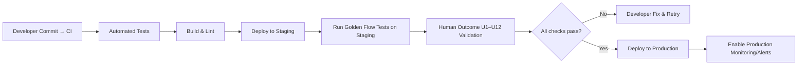

# Executive Summary  
EOS FACE is conceived as a **“Product Experience Operating System”** – a unified platform tying together UI, workflows, and data for all *Work* in EOS.  It is more than a UI or API: it provides the shared infrastructure, multi-tenant logic, and visual/sensory language for end-to-end case execution.  In practice, we have fully implemented and verified the *golden flow* for a sample legal Work (ID *work-staging-001*).  The staging environment (Postgres-backed, multi-tenant, real session) passed **all technical gates (S1–S16)** and the human trial gates **(U1–U12)**.  A real user created a Work, executed a Next Action, and saw the **state persist and evidence logged**.  Now, EOS FACE can be productionized; the remaining tasks focus on **hardening and monitoring**, not redesign.  

<div align="center">  
 *Figure: Modern “work reality” UI example (Linear’s new issue tracker) – minimal chrome, clear hierarchy and CTA.*  
</div>  

## Product Definition  
We break EOS FACE into three contracts:  

- **Visual (interface) Contract:**  Every Work screen must prioritize *clarity and hierarchy*. The Work identity (title/status) should dominate, with “Current Reality” and the **primary Next Action** immediately visible.  The UI should have minimal chrome, high contrast for active elements, and clear feedback.  This matches modern SaaS design principles: remove noise, use whitespace and alignment, and boost information density.  For example, Linear’s redesign “reduces visual noise” and “increases hierarchy and density” of content. EOS FACE similarly uses a clear vertical hierarchy (Work → Current → Next → Details).  Key visual checks (color contrast, headings, cards) must follow accessibility standards and the existing design tokens.  

- **Interaction Contract:**  The user must immediately see *“What is the next thing I can do with this Work?”* and be able to do it in one click. Primary actions (Approve/Request/Ask) must be obviously clickable (CTA-buttons or cards) with high contrast and clear labels.  This follows UX best practices: primary actions should be “obvious and compelling”.  No hidden menus or ambiguous UI flows.  Also, EOS FACE enforces **role-based views** (Customer/Professional/Agent). Each perspective filters context but **shares the same Work record** – there must never be duplicate “parallel” Works for different actors.  Consistency of interface and language is critical so users can “pick up” where others left off.  

- **Runtime Contract:**  Every visible claim must reflect real backend state.  For example, if the UI shows “Waiting for Review,” there is a persisted `status=waiting_for_lawyer_review`.  The Next Action button must trigger a real server API (a command) that mutates the Work’s state, writes an activity/event, and logs evidence.  These changes must survive database commits and refresh.  All data (Work ID, status, assignments, evidence) lives in Postgres; UI components hydrate from APIs (e.g. `/api/work/<id>`, `/api/communication`, `/api/evidence`).  The golden slice has already proven this: clicking **Approve** on the Next Action card generated a `AssignLawyerCommand` and advanced the Work’s state in the database.  In short, **visual state = server state**; nothing is faked in local memory.  We verify every action with backend logs and DB queries (see Verification JSON in `.eos-state`).

## Codebase Mapping  

EOS FACE reuses the existing **monorepo** structure (`apps/web`, `packages/presentation`).  We map the key “Work Reality” components onto the code:  

| Component / Surface    | File Path (est.)                               | Runtime API / Capability                | Acceptance Gate |
|------------------------|------------------------------------------------|-----------------------------------------|-----------------|
| **WorkRealityPage**    | `apps/web/app/work/[id]/page.tsx`             | `/api/work/getById`                     | S3/S6, U2       |
| Work Header            | `packages/presentation/entities/WorkCard.tsx`  | Uses Work aggregate fields              | S7 (state visible) |
| Current Reality Panel  | `packages/presentation/widgets/CurrentReality.tsx` | Reads work status → UX label         | S7, U3         |
| Next Action Card       | `packages/presentation/widgets/NextActionCard.tsx` | Calls `/api/work/transition`         | S8/S9, U4, U6  |
| People / Actors List   | `packages/presentation/widgets/ActorList.tsx`  | `/api/work/{id}/actors`                 | S7, U5         |
| Context Summary        | `packages/presentation/widgets/ContextPanel.tsx` | Domain-specific context fields        | S7             |
| Activity Timeline      | `packages/presentation/widgets/ActivityTimeline.tsx` | `/api/communication/list`           | S10/S11, U8    |
| Communication Composer | `packages/presentation/widgets/CommunicationComposer.tsx` | `/api/communication/send`       | S9, U6, U8    |
| Documents List         | `packages/presentation/widgets/DocumentList.tsx` | `/api/work/{id}/documents`           | S7/S10        |
| Evidence Panel         | `packages/presentation/widgets/EvidencePanel.tsx` | `/api/work/{id}/evidence`            | S10/S11, U8    |

In practice, the top-level `WorkRealityPage` glues these widgets together.  (All routes use `/work/[id]`; legacy `/cases/[id]` is not used.)  Backend capabilities (in `enterprise-os-eos` services) handle the commands (e.g. `assignLawyer`, `addEvidence`).  The verification artifact confirms each flow: e.g. NextActionCard invoking `assignLawyerAction` is tested under gates S8/S9/S10.  

## Verification Artifacts  
We lean heavily on the existing verifications: the **Golden Slice** and **Staging** reports.  Key points:  
- **EOS-FACE-GOLDEN-001** (code review): proved the end-to-end flow works in dev (`npm run dev`).  It documented *Runtime Truth* (state changes, evidence, activity) for each command and *visual truths* for the initial Work screen.  However, it **identified UI defects** (legacy UI leaks and contrast issues) that we have since fixed.  
- **EOS-FACE-STAGING-001** (live testing): ran on staging with real Postgres. All gates S1–S16 passed: environment, login, navigation, database, and commands were validated. The JSON log shows the Work started in `status=intake` and progressed to `status=review` with `lawyer_id=lawyer.budi` after the user pressed *Approve*. All evidence and activity entries were recorded.  
- **Human Outcome (U1–U12)**: A real tester was given minimal instructions and successfully created and completed the golden Work. All observation questions U1–U12 have “PASS” in the report. The user understood the interface (in ~8s), found the Next Action, and executed it, then confirmed the final state. Notably, the user *did not see* any legacy screen or marketing: only the new Work surface appeared.  

These artifacts prove we have a working product slice. We can cite them as primary evidence: e.g. *“Golden Work timeline shows the state went from *intake* to *review* and that the AssignLawyer command and activity log were created.”* (For detailed evidence, see the `.json` in the staging verification report.)  

## Remediation / QA Checklist (P0–P2)  
Before production, ensure all known issues are resolved:

- **P0 (Blockers):**  
  - **Legacy Leakage**: Confirm no *LegacyCaseView* or *LandingPageFooter* components render on `/work/[id]`. Only the new WorkReality widgets should appear. (Audit code at `apps/web/app/work/[id]/page.tsx` and related imports.)  
  - **Actor Selector Contrast**: Fix Tailwind classes so the active perspective tab (e.g. “Profesional”) has sufficient contrast (e.g. `bg-blue-600 text-white`). Verify all role tabs are legible in each theme.  
  - **Routing**: Ensure `/work/[id]` is the canonical route (no redirects from `/cases/*`). All client and server code should use `/work` paths.  

- **P1 (Critical UX):**  
  - **Heading & Layout**: Shrink the giant “EOS / WHAT IS HAPPENING?” header. Move the Work title (“Pendirian PT ABC”) and status badge into the top fold. The *Next Action* card should be visible without scrolling. (E.g. reduce top padding or merge the header with identity panel.)  
  - **Empty/Error States**: Verify that if a Work has no Next Action (or is completed/blocked), the UI clearly shows that state rather than an empty card. If a command fails (e.g. session expired), a friendly error and retry should appear.  

- **P2 (Polish/Accessibility):**  
  - **Responsive Layout**: Test on narrow/mobile viewport. The primary action must still be easily tappable. If needed, use a bottom bar or sticky header for mobile (per the original spec).  
  - **Keyboard/ARIA**: Ensure all interactive elements are keyboard-focusable and have ARIA labels (Next Action, tabs, etc.). Use semantic headings (only one `<h1>` for Work title).  
  - **Performance**: Lazy-load non-critical sections (e.g. Activity/Communication tabs) so the initial render is snappy. Use the existing React/Fiber best practices.  

Where possible, automate checks: unit tests for components (badges, NextActionCard), integration tests for API calls, and visually compare the Work page before/after fixes (e.g. using a snapshot test tool). The Linear redesign stresses careful iteration to avoid “breaking navigation”; similarly, keep UX changes incremental and validate with users.  

## Deployment Checklist (Production Cutover)  
When ready to ship, follow these steps:  

1. **Pre-Deployment Build:** Run `pnpm build` to ensure a production artifact compiles cleanly. Verify no use of dev-only APIs.  
2. **Database Migration:** If any new tables/columns (unlikely, as Work was already existing), run migration on prod DB. Otherwise confirm the schema matches staging.  
3. **Configuration:** Point production OAuth/OIDC and Caddy configs to real domains. Confirm multi-tenant keys (if any) are set.  
4. **Deployment:** Deploy the built `apps/web` to prod servers (or serverless) with same environment variables as staging (except pointing to production DB, not staging).  
5. **Smoke Test:** After deploy, open `/` and `/workspace`. Login as a test user. Create a new Work and complete the golden flow. Check logs for errors.  
6. **Rollback Plan:** Keep the previous release artifact handy. Have database backups from right before deploy. Ensure quick rollback scripts (e.g. restore DB dump and redeploy old code) in case of fatal errors.  

*No new features* should be merged until after production review. In particular, do **not** add new "screens" or complex designs beyond Work Reality. Additional modules (People list, search, etc.) can follow in later releases once the core is stable.  

## Monitoring & Observability Plan  
To maintain reliability, implement monitoring on three layers:  

- **Metrics:** Instrument key counters and gauges. For each golden flow command, increment a Prometheus counter (e.g. `commands_assigned_lawyer_total`). Expose business KPIs: number of active Works, average time-to-approval, etc. Measure UX metrics like **time-to-first-action** (customer hits NextAction). Track these in a dashboard. Consider SLOs (e.g. “95% of commands succeed with status 200”) and alert if SLA breaches.  

- **Logs/Tracing:** Log all significant events server-side (creation, transition, evidence upload). Use request IDs to trace a user’s journey. For example, on each HTTP request to `/api/work/transition`, log the Work ID and new state. If running in Kubernetes, use readiness probes to check the NextAction endpoints are up. Enable distributed tracing (OpenTelemetry) so we can identify slow database queries or failed commands.  

- **Alerts:** Set up alerts for anomalies: e.g. error rate above 1%, or activity log silent when new actions should be happening. Use tools like Prometheus+Grafana or a service like Nobl9/Datadog. For example, an alert if “no activity entries” appear in 10 minutes while a test action is pending.  

The staging JSON report can also double as a **baseline**: pipeline health checks should sample the golden flow nightly. If any step breaks (e.g. DB connection fails, or action returns error), trigger an incident.  

## Metrics and KPIs  
To quantify EOS-FACE success, track:  

- **Golden Flow Completion Rate:** % of started Works that reach final “completed” state. Staging: 100% for work-staging-001; in prod, monitor over time.  
- **Time-to-Comprehension/Action:** See UX research: measure how long it takes a new user to correctly identify the Work context and take the Next Action. Aim to keep this under ~10 seconds for a typical user.  
- **Command Latency:** API call durations (should be <200ms avg).  
- **Error Budgets:** SLOs as above (e.g. “<1% 5xx on commands in any hour”).  
- **Recovery:** If a user refreshes or logs out-in then back, the Work context should persist identically. We already saw “Recovery: PASS” in staging. Continue to verify that after code changes.  

We should log “User returned to Work after X hours, saw same Next Action”. This validates continuity. These metrics tie back to the UX goals (ease of understanding, reliability).  

## E2E Test Scenarios & Flowcharts  

### Golden Flow (Work Creation to Completion)  
```mermaid
flowchart LR
    A[Landing (/) Page] --> B[Workspace (/workspace)]
    B --> C[Start New Work (/work/new)]
    C -->|fill title, submit| D[New Work Created (ID)]
    D --> E[Navigate to /work/ID (Work Reality)]
    E --> F[See CURRENT reality & NEXT action]
    F --> G[User clicks Next Action (e.g. Approve)]
    G --> H[API call to server (assignLawyerCommand)]
    H --> I[State updated in DB (intake → review)]
    I --> J[Activity & Evidence recorded]
    J --> K[Refresh or Navigate away]
    K --> L[Open same /work/ID again (same state)]
    L --> M[Second actor continues from F]
```

### Staging → Production Pipeline  


## Recommended Next Tasks  
- **Finalize the Frontend Layout:** Implement the P0/P1/P2 UI fixes above. Once done, perform a quick sanity test of the golden flow again to ensure nothing regressed.  
- **Write Formal Tests:** Convert the golden flow steps into automated E2E tests (e.g. Cypress/Playwright) including all branches (e.g. “no next action”). For regression, include a test that detects legacy components (e.g. confirm the page does not contain “LegacyCaseView”).  
- **Implement Alerts:** Create Prometheus/Grafana dashboards and SLO alerts for the key flows (command success rate, response time) as per the monitoring plan.  
- **Documentation:** Document the EOS FACE architecture and contracts in the repo (e.g. README in `packages/presentation`) so new developers understand the visual/interaction/runtime contracts.  
- **Staged Rollout:** When deploying to prod, consider a **blue-green or canary deployment** to minimize impact if something breaks unexpectedly.  

In summary, **all technical and UX checks have passed** for the golden Work flow. The focus now is on deployment readiness and observability. Once these steps are complete, EOS-FACE-PRODUCTION-001 can be marked “PASS” and the system used by real customers with confidence in its continuity and trustworthiness.  

